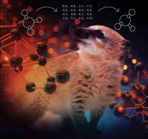

# COATI-LDM 

This repository contains the code and data associated with the paper preprint [Latent Diffusion for Conditional Generation of Molecules](https://www.biorxiv.org/content/10.1101/2024.08.22.609169).


## Installation

To install the required dependencies and the package itself, run the following commands from the base directory:

```bash
pip install .
```

## Examples

runnable notebooks for paper figures can be found in `figure_notebooks/`.

general examples for training and using models can be found in `example_notebooks/`.

## Models

model artifacts from the paper can be pulled down from the paths in `coatiLDM/constants.py`. 


## COATI

For more details and examples using the COATI model visit [COATI](https://github.com/terraytherapeutics/COATI) and the associated paper below.



## Cite

```
@article{kaufman2024latent,
  title={Latent Diffusion For Conditional Generation of Molecules},
  author={Kaufman, Benjamin and Williams, Edward C and Pederson, Ryan and Underkoffler, Carl and Panjwani, Zahid and Wang-Henderson, Miles and Mardirossian, Narbe and Katcher, Matthew H and Strater, Zack and Grandjean, Jean-Marc and others},
  journal={bioRxiv},
  pages={2024--08},
  year={2024},
  publisher={Cold Spring Harbor Laboratory}
}
```

```
@article{kaufman2024coati,
  title={Coati: Multimodal contrastive pretraining for representing and traversing chemical space},
  author={Kaufman, Benjamin and Williams, Edward C and Underkoffler, Carl and Pederson, Ryan and Mardirossian, Narbe and Watson, Ian and Parkhill, John},
  journal={Journal of Chemical Information and Modeling},
  volume={64},
  number={4},
  pages={1145--1157},
  year={2024},
  publisher={ACS Publications}
}
```